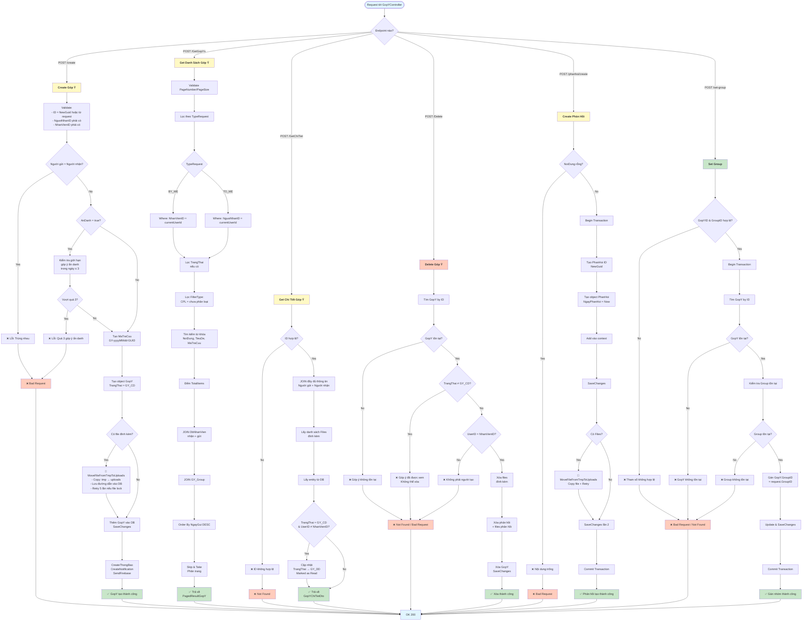

# GopYController - Flowchart Luồng Xử Lý

## Chú Thích Luồng Xử Lý

### 1. **Create Góp Ý** (`POST /api/gopy/create`)
- Kiểm tra validation người gửi, người nhận
- Kiểm tra giới hạn góp ý ẩn danh (≤3/ngày)
- Tạo mã tra cứu `GY-yyyyMMdd-GUID`
- Xử lý file: Copy từ `tmp` → `uploads` (retry nếu file lock)
- Lưu GopY vào DB with `TrangThai = GY_CD` (Chưa Đọc)
- Gửi thông báo Firebase

### 2. **Get Danh Sách Góp Ý** (`POST /api/gopy/GetGopYs`)
- Lọc theo: `BY_ME` (góp ý của tôi), `TO_ME` (góp ý gửi đến tôi)
- Lọc theo trạng thái, nhóm, tìm kiếm từ khóa
- JOIN nhân viên (gửi, nhận) + nhóm phân loại
- Sắp xếp by `NgayGui DESC`
- Phân trang `Skip/Take`

### 3. **Get Chi Tiết Góp Ý** (`POST /api/gopy/GetChiTiet`)
- Kiểm tra ID hợp lệ
- JOIN đầy đủ thông tin, lấy files đính kèm
- **Tự động cập nhật status**: `GY_CD` (Chưa Đọc) → `GY_DD` (Đã Đọc)
- Trả về full details + attachments

### 4. **Delete Góp Ý** (`POST /api/gopy/Delete`)
- Kiểm tra GopY tồn tại
- Kiểm tra `TrangThai == GY_CD` (chỉ xóa khi chưa được xem)
- Kiểm tra chỉ người tạo mới được xóa
- Xóa cascading: Files → PhanHoi + Files PhanHoi → GopY

### 5. **Create Phản Hồi** (`POST /api/gopy/phanhoi/create`)
- Validate nội dung không trống
- Begin Transaction
- Tạo PhanHoi + xử lý files (copy tmp → uploads)
- Commit / Rollback

### 6. **Set Group Phân Loại** (`POST /api/gopy/set-group`)
- Kiểm tra GopY + Group tồn tại
- Cập nhật `GopY.GroupID`
- Transaction bảo vệ tính toàn vẹn dữ liệu

## Tính Năng Chính
✅ File handling: Copy file from tmp → uploads (retry 5 lần nếu lock)
✅ Status tracking: Auto update GY_CD → GY_DD khi xem
✅ Anonymous feedback: Giới hạn 3 góp ý ẩn danh/ngày
✅ Transaction safety: Rollback nếu có lỗi
✅ Firebase notifications: Gửi thông báo cho người nhận
✅ Pagination + filtering + search
